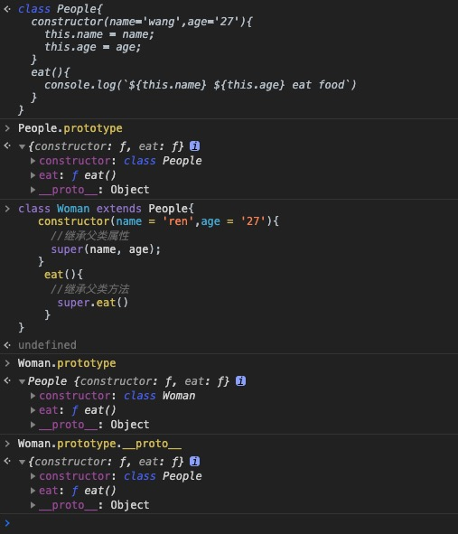

# JavaScript重要知识点

## **语言本身**

### **严格模式**

参见：[https://developer.mozilla.org/zh-CN/docs/Web/JavaScript/Reference/Strict_mode](https://developer.mozilla.org/zh-CN/docs/Web/JavaScript/Reference/Strict_mode)

### **数据类型/原始值**

原始值类型：Number、BigInt、String、Boolean、Undefined、Null、Symbol

引用类型：Object

null是原始值，为什么`typeof null === 'object'`？参见：
- [https://developer.mozilla.org/zh-CN/docs/Web/JavaScript/Reference/Operators/typeof#null](https://developer.mozilla.org/zh-CN/docs/Web/JavaScript/Reference/Operators/typeof#null)
- [https://2ality.com/2013/10/typeof-null.html](https://2ality.com/2013/10/typeof-null.html)

### **实现继承方式**

对继承的理解：拷贝一个或多个对象的属性或方法到另一对象上，或一个或多个对象的属性或方法被另一个对象共享（单向的）（如：原型链）

参见：
- [https://developer.mozilla.org/zh-CN/docs/Web/JavaScript/Inheritance_and_the_prototype_chain](https://developer.mozilla.org/zh-CN/docs/Web/JavaScript/Inheritance_and_the_prototype_chain)
- [https://developer.mozilla.org/zh-CN/docs/Web/JavaScript/Reference/Global_Objects/Object/create](https://developer.mozilla.org/zh-CN/docs/Web/JavaScript/Reference/Global_Objects/Object/create)
- [https://developer.mozilla.org/zh-CN/docs/Web/JavaScript/Reference/Global_Objects/Object/setPrototypeOf](https://developer.mozilla.org/zh-CN/docs/Web/JavaScript/Reference/Global_Objects/Object/setPrototypeOf)
- [https://developer.mozilla.org/zh-CN/docs/Web/JavaScript/Reference/Global_Objects/Object/assign](https://developer.mozilla.org/zh-CN/docs/Web/JavaScript/Reference/Global_Objects/Object/assign)

定义父类：
```javascript
function Parent() {
  this.prop = ''
}
Parent.prototype.method = function() {}
```

#### **原型继承**

```javascript
function Child() {}
Child.prototype = new Parent()
Child.prototype.construcor = Child
```

缺点：
- 无法向父类传递参数
- 无法实现多继承

#### **构造函数继承**

```javascript
function Child() {
  Parent.call(this, /* 父类参数 */)
}
```

优点：
- 子类构造函数可以向父类构造函数传递参数
- 可以实现多继承（多个父类call/apply调用）

缺点：
- 继承父类方法，父类方法只能在构造函数中定义，导致实例无法复用方法
- 无法继承父类原型属性及方法

#### **组合继承（原型+构造函数）**

```javascript
// 通过构造函数继承父类属性
function Child() {
  Parent.call(this, /* 父类参数 */)
}
// 通过原型继承父类原型属性/方法
Child.prototype = new Parent()
Child.prototype.constructor = Child
```

缺点：
- 父类存在两次实例创建

#### **寄生组合继承**

```javascript
// 通过构造函数继承属性
function Child() {
  Parent.call(this, /* 父类参数 */)
}
// 通过原型继承父类原型属性方法
// (function() {
//   const Super = function() {}
//   Super.prototype = Parent.prototype
//   Child.prototype = new Super()
//   Child.prototype.constructor = Child
// })()
Child.prototype = Object.create(Parent.prototype)
Child.prototype.constructor = Child
```

#### ~~**拷贝继承**~~

#### ~~**实例继承**~~

#### **es6实现继承**

```javascript
class Child extends Parent {
  constructor() {
    super(/* 父类属性 */)
  }
}
```



### **闭包、this**

### **函数柯里化**

### [**func.bind(context)**](https://developer.mozilla.org/zh-CN/docs/Web/JavaScript/Reference/Global_Objects/Function/bind)

简单实现：
```javascript
function bind(context, func) {
  return function(...args) {
    func.call(context, ...args)
  }
}
```

实例：
```javascript
func.bind(obj1).bind(obj2).bind(obj3)
// 不难看出func执行bind后（不管多少个），都只跟第一个绑定对象有关
```
### **箭头函数，this指向**

词法作用域，由其上下文决定，参见：[https://developer.mozilla.org/zh-CN/docs/Web/JavaScript/Reference/Functions/arrow_functions](https://developer.mozilla.org/zh-CN/docs/Web/JavaScript/Reference/Functions/arrow_functions)

  - apply/call/bind无法修改this指向
  - 不绑定arguments
  - 箭头函数不能作为构造函数，和new一起使用会报错
  - 箭头函数没有prototype属性
  - yield关键字不能在箭头函数中使用
  - 箭头函数具有与常规函数不同的特殊运算符优先级解析规则

### **toString、valueOf区别**

参见：

原始值：
- https://developer.mozilla.org/zh-CN/docs/Web/JavaScript/Data_structures
- https://developer.mozilla.org/zh-CN/docs/Web/JavaScript/Reference/Global_Objects/Object/toString
- https://developer.mozilla.org/zh-CN/docs/Web/JavaScript/Reference/Global_Objects/Object/valueOf

### **===/==，相等判断**

参见：
- [https://developer.mozilla.org/zh-CN/docs/Web/JavaScript/Equality_comparisons_and_sameness](https://developer.mozilla.org/zh-CN/docs/Web/JavaScript/Equality_comparisons_and_sameness)
- [https://developer.mozilla.org/zh-CN/docs/Web/JavaScript/Reference/Operators/Comparison_Operators](https://developer.mozilla.org/zh-CN/docs/Web/JavaScript/Reference/Operators/Comparison_Operators)

### **Promise、async、await, iterator、generator**

http://www.ruanyifeng.com/blog/2015/05/async.html
http://www.ruanyifeng.com/blog/2015/04/generator.html

### **for...of与for…in区别**

for…of对象必须包含Symbol.iterator属性，不能遍历普通对象

参见：
- [https://developer.mozilla.org/en-US/docs/Web/JavaScript/Reference/Global_Objects/Symbol/iterator](https://developer.mozilla.org/en-US/docs/Web/JavaScript/Reference/Global_Objects/Symbol/iterator)

### **null/undefined区别**

undefined
* 一个声明未定义的变量的初始值，或没有实际参数的形式参数
* undefined作为全局对象的一个属性

null
* 表示缺少的标识，特指对象的值未设置

参见：
- [https://developer.mozilla.org/en-US/docs/Glossary/undefined](https://developer.mozilla.org/en-US/docs/Glossary/undefined)
- [https://developer.mozilla.org/zh-CN/docs/Web/JavaScript/Reference/Global_Objects/undefined](https://developer.mozilla.org/zh-CN/docs/Web/JavaScript/Reference/Global_Objects/undefined)
- [https://developer.mozilla.org/zh-CN/docs/Web/JavaScript/Reference/Global_Objects/null](https://developer.mozilla.org/zh-CN/docs/Web/JavaScript/Reference/Global_Objects/null)
- []()

### **CommonJS模块与ES6模块区别**

---
---

## **宿主环境**

### **DOM事件**

阶段：捕获(**Document节点->目标节点**)、目标、冒泡(**目标节点->Document节点**)

级别：DOM0、DOM2、DOM3

参见：
- [https://juejin.im/post/5cea4a485188251a115f3ef9](https://juejin.im/post/5cea4a485188251a115f3ef9)

### **e.target,e.currentTarget分别指的什么？**

e.target为触发事件的对象

e.currentTarget为事件绑定的元素

参考：
- [https://developer.mozilla.org/zh-CN/docs/Web/API/Event/currentTarget](https://developer.mozilla.org/zh-CN/docs/Web/API/Event/currentTarget)
- [https://developer.mozilla.org/zh-CN/docs/Web/API/Event/target](https://developer.mozilla.org/zh-CN/docs/Web/API/Event/target)

### **script标签async、defer属性**

参见：[https://developer.mozilla.org/zh-CN/docs/Web/HTML/Element/script](https://developer.mozilla.org/zh-CN/docs/Web/HTML/Element/script)

### **Event Loop、微任务、宏任务**

参见：[https://developer.mozilla.org/zh-CN/docs/Web/JavaScript/EventLoop](https://developer.mozilla.org/zh-CN/docs/Web/JavaScript/EventLoop)

### **setTimeout(f, 0)使用场景**

作为宏任务，参见[Event Loop](https://developer.mozilla.org/zh-CN/docs/Web/JavaScript/EventLoop)，延迟执行

### **Ajax/Fetch，fetch有哪些优势？**

参见：[https://www.cnblogs.com/chris-oil/p/6014323.html](https://www.cnblogs.com/chris-oil/p/6014323.html)

### **Cookie，session，localStorage，sessionStorage，后端怎么存储session?**

参见：[https://developer.mozilla.org/zh-CN/docs/Web/HTTP/Cookies](https://developer.mozilla.org/zh-CN/docs/Web/HTTP/Cookies)

### **跨域解决方案**

jsonp，`proxy`，`header(Access-Control-Allow-Origin)`，domain，name，postMessage